## 認可の方法2つ
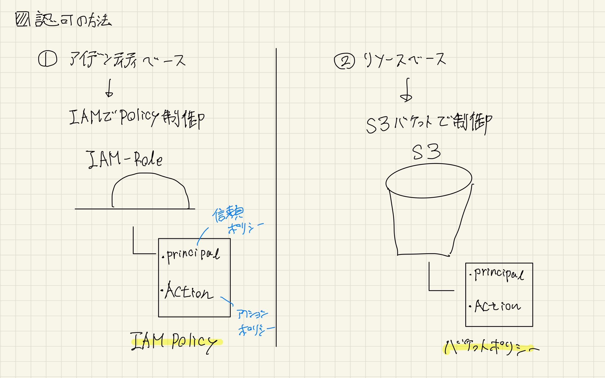

---

## アイデンティティーベース
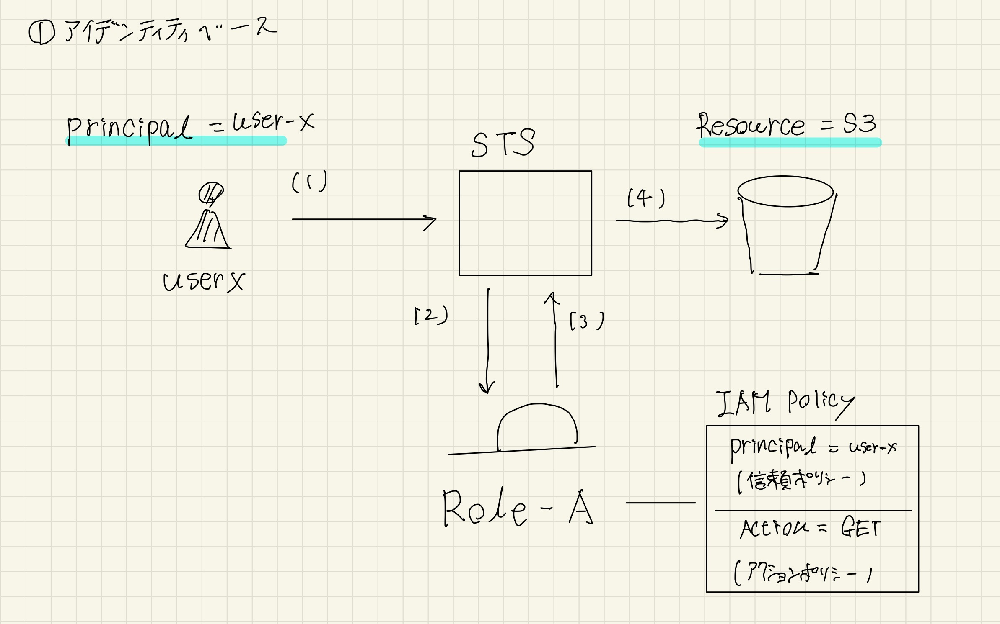

----

## フロー
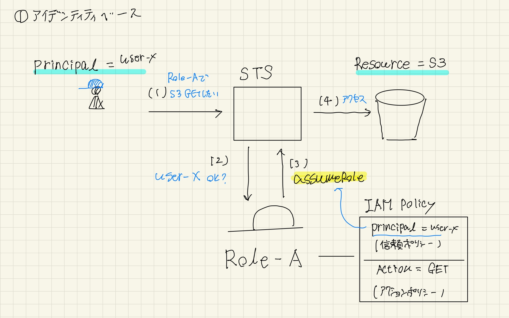

----

## 内部の場合
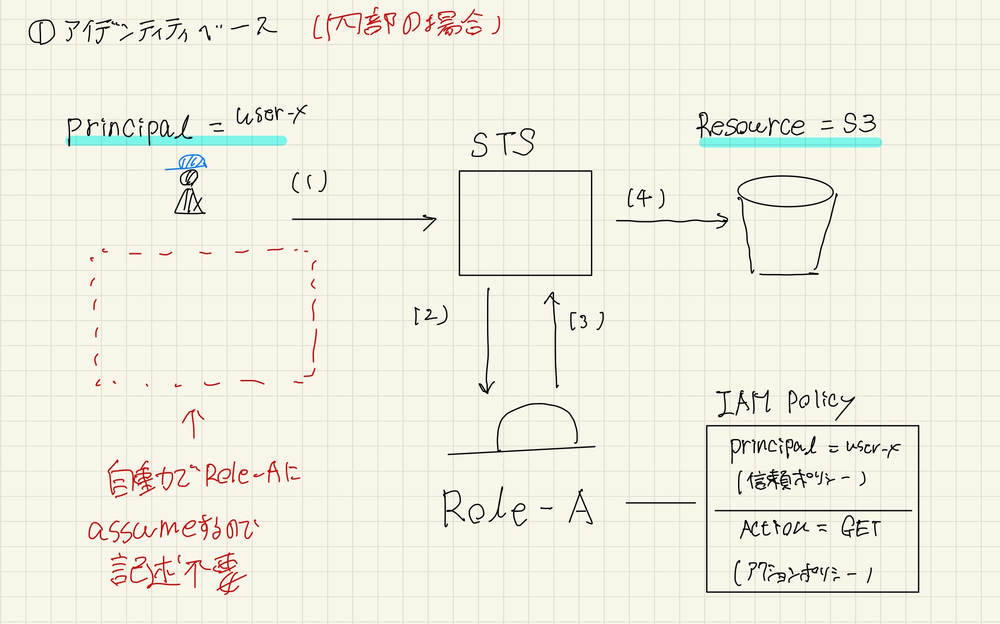

----

## 外部AWSの場合
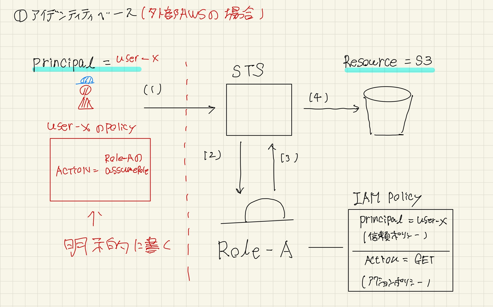

----

## 外部AWSの場合の注意点
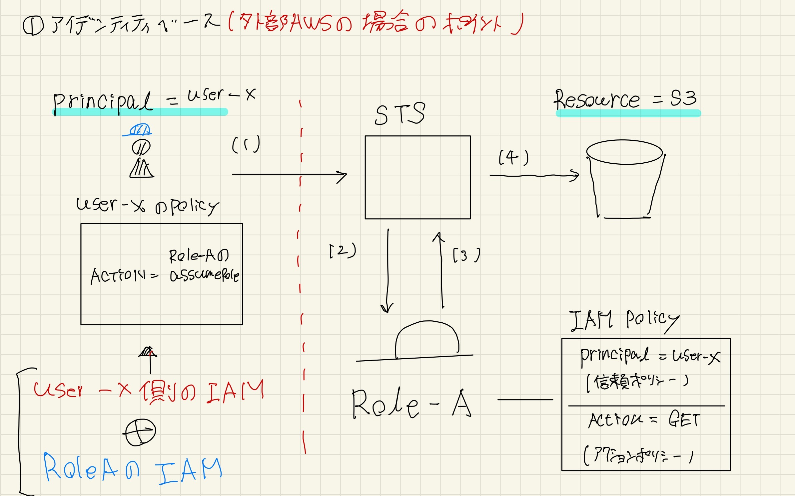

---

## リソースベース

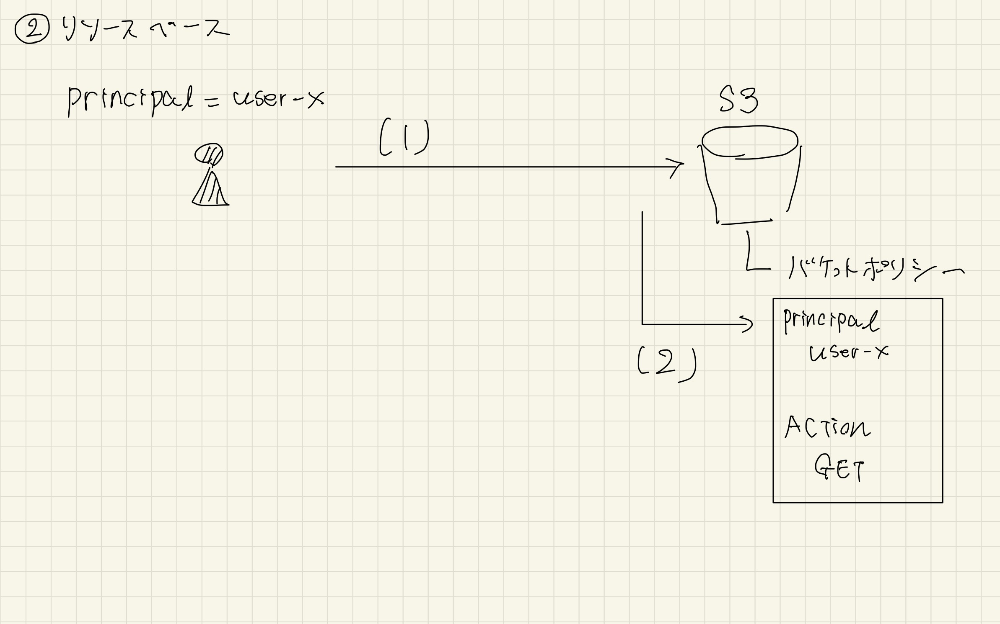

----

## フロー

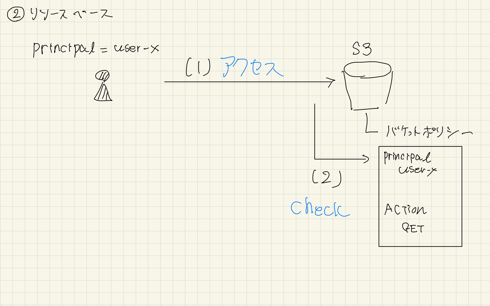

----

## 内部の場合
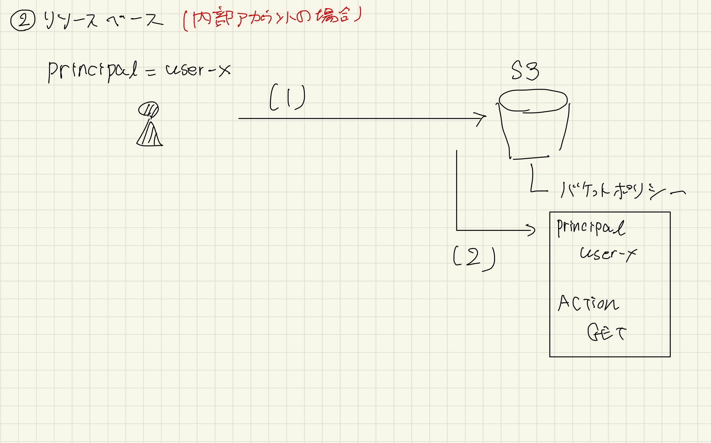

----

## 外部AWSの場合
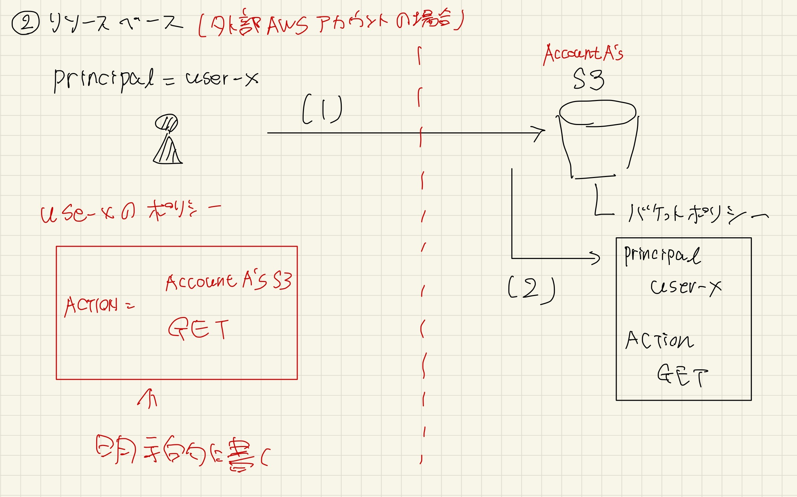

----

## 外部AWSの場合の注意点
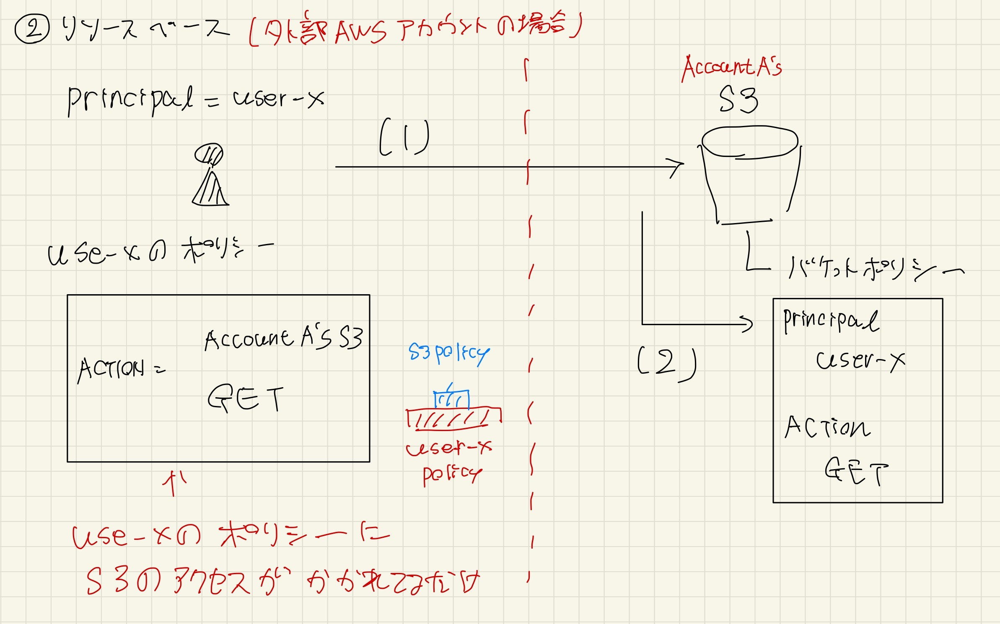

---

## Cognitoの場合
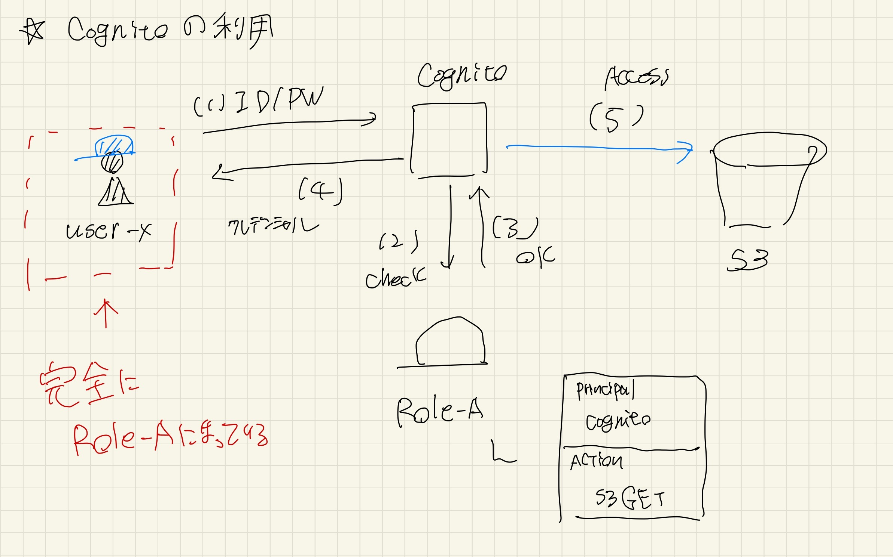

----

## Cognitoの場合の注意点
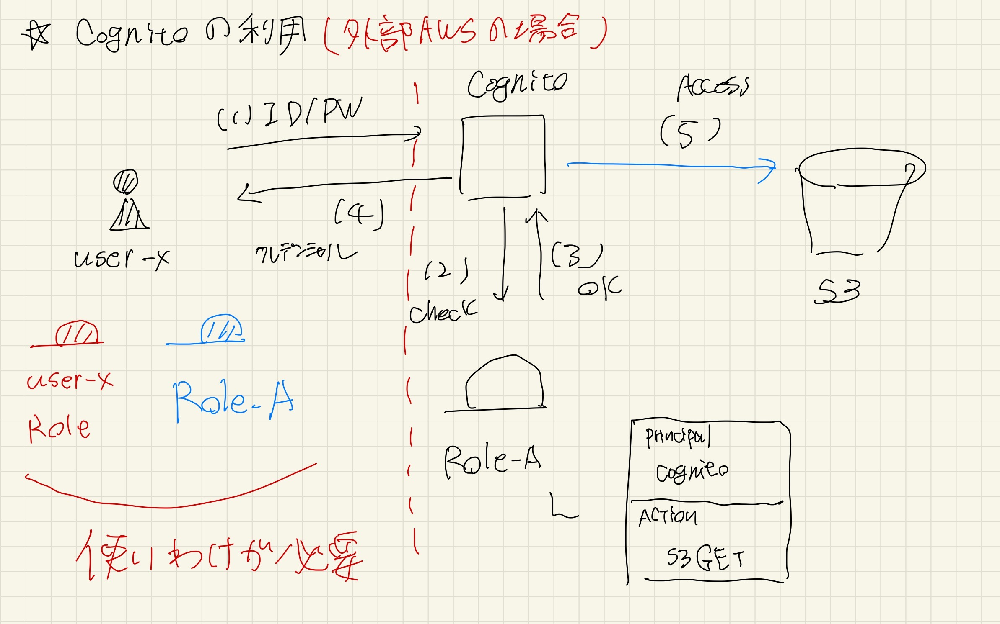
