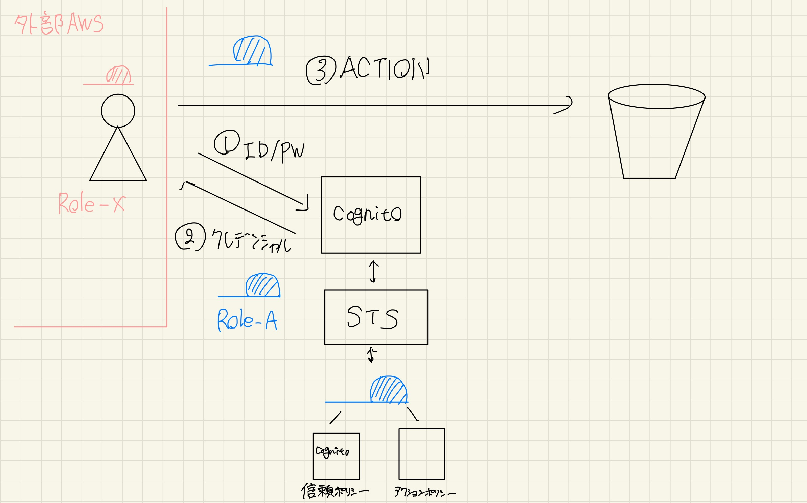

## 認可の方法2つ

    

        アイデンティティベース：IAMを利用して認可を行う 
        リソースベース：リソース自体に認可の情報を指定する
    

  

----
### 認可の分類

    

        <ul>
            <li>アイデンティティベース
                <ul>
                    <li>AssumeRole
                        <ul>
                            <li>同一AWSアカウント
                                <ul>
                                    <li>AWSリソース</li>
                                    <li>IAM Role</li>
                                </ul>
                            </li>
                            <li>別AWSアカウント
                                <ul>
                                    <li>IAM Role</li>
                                </ul>
                            </li>
                        </ul>
                    </li>
                    <li>Cognito
                        <ul>
                            <li>認証者がAWS以外</li>
                            <li>認証者がAWS</li>
                        </ul>
                    </li>
                </ul>
            </li>
        </ul>
    

    

        <ul>
            <li>リソースベース
                <ul>
                    <li>同一AWSアカウント</li>
                    <li>別AWSアカウント</li>
                </ul>
            </li>
        </ul>
    

---
## AWSの認可の基本

    

        principal：誰がこの認可を求めに来るか 
        resource：どのリソースへのアクションを許可するか 
        action：リソースに対する操作
    

  

----
### IAMの基本

    

        信頼ポリシー：IAM-policyをリクエストするprincipalを指定 
        アクションポリシー：ResourceとActionを指定
    

  

----
### STSとassume role 1

    

        STS：IAM-Roleを一時的に付与する機能 
        Assume role：指定したIAM-Roleを引き受ける機能
    

  

----
### STSとassume role 2

    

        STS：IAM-Roleを一時的に付与する機能 
        Assume role：指定したIAM-Roleを引き受ける機能
    

  

----
### STSとassume role 3

    

        STS：IAM-Roleを一時的に付与する機能 
        Assume role：指定したIAM-Roleを引き受ける機能
    

  

---
## アイデンティティーベース（AssumeRole)

    

        以下の3パターンが挙げられる 
        同一AWSアカウント内部からAWSリソースがAssumeする場合 
        同一AWSアカウント内部からIAMRoleがAssumeする場合 
        別AWSアカウントからIAMRoleがAssumeする場合
    

----
### 同一AWSアカウント内部からAWSリソースがAssumeする場合

    

        AWSリソースは同一アカウント内のRoleのみassume可能 
        リソース側は特に設定が不要 
        Role側の信頼ポリシーで対象リソースを認めておく
    

  

----
### 同一AWSアカウント内部からIAMRoleがAssumeする場合

    

        assumeするRole-BのアクションポリシーでRole-Aをstsする内容を書いておく
    

  

----
### 別AWSアカウントからIAMRoleがAssumeする場合

    

        assumeするRole-XのアクションポリシーでRole-Aをstsする内容を書いておく    
    

  

---
## アイデンティティーベース（Cognito)

    

        以下の2パターンについて説明する 
        認証相手が別AWSアカウント以外場合 
        認証相手が別AWSアカウントの場合
    

----
### 認証相手が別AWSアカウント以外場合

    

        CognitoにID/PWで認証してクレデンシャルを払い出す
    

  

----
### 認証相手が別AWSアカウントの場合

    

        CognitoにID/PWで認証してクレデンシャルを払い出す
    

  

---

## アイデンティティベースによる別AWSアカウントと連携する際の注意
----
### 古いロールを一時的に捨てる

    

        Roleを持っている人がassumeかcognitoで別Roleを受け取る 
        元々持っていたRoleを一時的に捨てる（帽子の履き替え）
    

[IAMロールの切り替え](https://docs.aws.amazon.com/ja_jp/IAM/latest/UserGuide/id_roles_use_switch-role-cli.html)

  

----
### 古いロールを捨てると古いロールに紐づいた認可を捨てる

    

        古いロールを一時的に捨てるということは、元々アクセスできていたリソースにアクセスできなくなるということ 
        以下の例だと青い帽子になると、左側のS3にはアクセスできなくなる
    

  

---
## リソースベース

    

        以下の2パターンについて説明する 
        同一AWSアカウント内部からアクセスする場合 
        別AWSアカウントからアクセスする場合
    

----
### 同一AWSアカウント内部からアクセス

    

        Resource側にprincipal、Resource、Action全てを書くだけでアクセス可能
    

  

----
### 別AWSアカウントからアクセス

    

        Resouce側にprincipal、Resouce、Action全てを書いておく 
        加えて、アクセスするRoleにResouceとActionを書いておくとアクセス可能 
        ポイントはRoleにポリシーが付与された形になるので帽子の履き替えが不要
    

  

